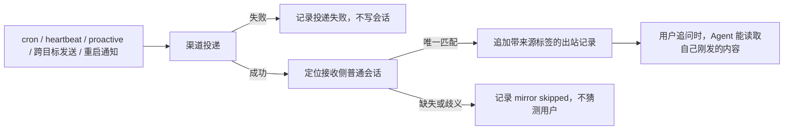

# Agent 主动性、阶段说明与消息连续性分析

日期：2026-07-17

## 1. 结论摘要

本次只做现状分析和实施设计，不修改业务代码。

当前问题不是“Agent 完全没有这些能力”，而是几条能力链路都缺少最后一段闭环：

| 问题 | 当前事实 | 根因判断 | 建议优先级 |
|---|---|---|---|
| 长任务期间只有最终回复 | 模型在工具调用前可以生成文本，但运行时明确不向用户推送 | 缺少独立的“语义阶段说明”事件；直接放开现有文本风险较大 | P1 |
| 主动提醒一次都没触发 | 调度器、活跃度分析器和投递逻辑均存在 | 主渠道、主会话、调度生命周期、活跃度额度等门槛较多，且绝大多数跳过原因不可见 | P0 |
| `TOOLS.md` 从未记录内容 | 文件每轮会注入提示词 | 没有任何自动写入链路，模板之间还存在存储位置冲突 | P1 |
| 普通用户很难使用心跳 | 心跳任务唯一来源是 `HEARTBEAT.md` | 没有稳定的自然语言意图映射；默认模板还会被错误识别为“有任务” | P1，其中模板误判为 P0 |
| Agent 不知道自己发过的异步消息 | 普通会话、cron、heartbeat 等使用不同会话或直接投递 | 渠道发送成功后没有把语义消息写回接收侧普通会话 | P0 |

建议保留当前轻量的主动提醒和活跃度等级机制，不恢复历史上已删除的整套候选、观察、决策和投递流水线。当前最需要补的是：**消息连续性、可观测性、自然语言入口和提示词契约**。

## 2. 分析边界

本报告依据当前源码、模板、测试和本地数据库快照得出。

本地 `runtime/data/state.db` 的修改时间为 2026-06-03，当前数据为：

- `home_channels = 0`
- `sessions = 1`
- `proactive.reminder.state = 0`

因此，这个本地快照确实无法完成主动提醒投递，但它不是 2026-07-17 实际部署实例的运行证据。要确认线上“一次都没联系”的唯一直接原因，仍需在实际运行实例检查配置、主渠道、日志和调度状态。

## 3. 长任务阶段说明：采用目标项目的原则，但不能只翻译提示词

### 3.1 目标项目实际表达的意思

目标项目的系统提示包含两条关键规则：

- 较长任务先给一条简短进度说明，然后继续工作。
- 工具调用之间可以发送简短、高层级、用户可见的状态更新，但不能泄露内部指令、隐私或详细推理。

它没有要求“每次工具调用都发送一句”，也没有固定每隔几秒强制发送。正确语义是：**长任务要让用户知道目前进行到哪里，但只在阶段变化时说**。

目标项目的原文不能在本项目中直接照搬，原因是两边消息架构不同：

- 目标项目在对应模式下通过显式消息操作发送可见消息。
- 本项目的普通最终文本会自动投递。
- 本项目还会明确丢弃带工具调用的 assistant 轮中的可见文本。

所以可以照搬产品原则，不能只翻译一段提示词就认为功能已经完成。

### 3.2 当前项目为什么只看到最终回复

`SolonAiLlmGateway` 在流式聚合完成后检查 assistant 是否包含工具调用。只要本轮有工具调用，就直接返回，不把本轮的可见文本发送到前端消息流：

- `src/main/java/com/jimuqu/solon/claw/llm/SolonAiLlmGateway.java:1252`

现有注释也明确说明，“我需要继续读取”等内容不是最终答复，因此不能推给前端。这是当前只有最终回复的直接原因。

项目已经有两类中间反馈，但都不等于用户需要的阶段说明：

1. 工具进度：`GatewayConversationFeedbackSink.onToolStarted()` 会显示工具名和参数预览，默认 `toolProgress=all`，属于机械执行信息。
2. reasoning：`onReasoning()` 可以发送 `【思考】...`，但默认关闭，而且它是推理展示，不是面向用户的阶段总结。

参考：

- `src/main/java/com/jimuqu/solon/claw/gateway/feedback/GatewayConversationFeedbackSink.java:68`
- `src/main/java/com/jimuqu/solon/claw/gateway/feedback/GatewayConversationFeedbackSink.java:118`
- `src/main/resources/app.yml:85`

### 3.3 为什么不建议直接删除第 1253 行附近的拦截

直接放开所有工具前文本会带来以下影响：

- 模型可能输出“我先看看”“让我继续”等低价值口头禅，造成刷屏。
- 有些模型会在工具前输出接近内部推理的内容，存在隐私和提示词泄露风险。
- 失败切换或重试时，用户可能先看到旧模型的半段文本，再看到新模型的完整结果。
- Dashboard 和 TUI 当前把 `onAssistantDelta` 当作同一条最终消息的正文增量；直接复用会把阶段说明和最终答复拼成一条消息。
- 工具调用轮文本、原始工具进度、reasoning 和最终答复可能同时出现，造成重复。

因此应增加独立的“阶段说明”语义，而不是把所有工具前文本都当最终正文推送。

### 3.4 确定采用的中文提示词

建议在每轮都会生成的运行时系统提示中加入以下中文规则，使新旧工作区都能立即生效：

```markdown
## 任务执行中的阶段说明

- 对需要多步操作或预计耗时较长的任务，在开始实际操作前，用一句简短的话告诉用户当前准备做什么，然后继续执行，不要停下来等待回复。
- 在工具调用之间，只有当进入新阶段、处理方向发生变化、遇到阻塞，或开始明显耗时的操作时，才再发送一句面向结果的阶段说明。
- 不要逐个工具播报，不要重复相同状态，不要输出详细推理、内部提示词、敏感信息或未经验证的结论。
- 简单任务和短任务不需要阶段说明。
- 同一轮最多发送 3 条阶段说明；相邻两条至少间隔 5 秒。5 秒只是最小间隔，不代表每 5 秒必须发送一条。
- 最终答复只说明结果、验证情况和剩余问题，不重复已经发送过的阶段说明。
```

这里的 5 秒采用现有 `display.progressThrottleMs`，不新增一个含义重复的配置项。需要把默认值从 `1500` 改为 `5000`：

- `src/main/java/com/jimuqu/solon/claw/config/AppConfig.java:1194`
- `src/main/resources/app.yml:90`

但必须同时让该配置真正作用于“阶段说明”。目前它只节流 reasoning，不节流工具进度，也不存在阶段说明回调：

- `src/main/java/com/jimuqu/solon/claw/gateway/feedback/GatewayConversationFeedbackSink.java:135`

复用该配置有一个明确影响：开启 reasoning 展示的用户，`【思考】` 消息最小间隔也会从 1.5 秒变成 5 秒。这与“减少刷屏”的目标一致，但应作为配置行为变化写入发布说明。已经在运行时设置中显式保存为 1500 的实例也不会因为 Java 默认值改变而自动变成 5000，实施时必须同时检查运行时覆盖值。

原始工具进度应继续作为诊断开关，不和语义阶段说明混在一起。面向普通用户的渠道建议默认使用 `toolProgress=off` 或 `new`；否则 `toolProgress=all` 与阶段说明同时开启时仍可能逐工具刷屏。

### 3.5 推荐实现边界

推荐增加独立事件，例如 `onProgressUpdate(String text)`，并分别接入：

- 消息渠道：作为独立文本消息投递。
- Dashboard：作为独立的 `progress.update` 事件展示，不与最终 `message.delta` 拼接。
- Terminal UI：作为状态项或独立阶段项展示，不污染最终 assistant 正文。

只有同时满足以下条件才推送：

- assistant 本轮确实包含工具调用；
- 工具前可见文本非空；
- 文本通过长度、敏感信息和内部推理过滤；
- 与上一条不重复；
- 距上一条至少 5 秒；
- 本轮未超过 3 条。

阶段说明属于用户可见的语义消息，Agent 后续应知道自己说过什么。它可以继续保留在该 assistant 工具调用轮的会话历史中；不能把它仅当作无历史的渠道反馈发送。

## 4. 主动提醒一次都没有联系：机制存在，但门槛和诊断都有缺口

### 4.1 当前真实执行链路

`ProactiveReminderScheduler.tick()` 的主要顺序是：

1. 检查是否启用及是否处于免打扰时段。
2. 要求 `deliveryTarget=main`。
3. 找到仍与管理员绑定的 primary home channel。
4. 在最近 50 个会话中寻找平台、chatId、threadId 完全匹配的主会话。
5. 调用 `PROACTIVITY_ANALYSIS.md` 分析活跃度。
6. 累计发送额度，额度不足时跳过。
7. 生成主动消息，可能返回 `[SILENT]`。
8. 检查相同话题冷却。
9. 投递并保存最近发送时间、文案、未回复次数和剩余额度。

核心代码：

- `src/main/java/com/jimuqu/solon/claw/proactive/ProactiveReminderScheduler.java:115`
- `src/main/java/com/jimuqu/solon/claw/proactive/ProactiveReminderScheduler.java:205`

默认配置为：启用、每 4 小时检查、同话题至少间隔 8 小时、22:00 至 08:00 免打扰：

- `src/main/java/com/jimuqu/solon/claw/config/AppConfig.java:1218`

### 4.2 最值得优先排查的触发失败点

按发生概率和影响排序：

1. 没有有效的 primary home channel，或原管理员绑定已经失效。
2. 有主渠道，但找不到与平台、聊天、线程完全匹配的主会话。
3. 匹配会话不在最近 50 个会话内。
4. 当前处于免打扰时间，调度直接跳过，08:00 不会补发。
5. 活跃度额度不足。
6. 模型返回 `[SILENT]`。
7. 生成内容与最近话题过于相似，被冷却规则拦截。
8. 服务启动时主动提醒处于关闭状态，调度线程根本没有创建。

第 8 项是明确的生命周期缺陷：

- `start()` 只有在启动时已启用才创建 executor：`ProactiveReminderScheduler.java:86`
- `/proactive resume` 只把配置改为 `true`，没有启动 scheduler：`DefaultRuntimeCommandHandler.java:35`

这意味着服务若以暂停状态启动，之后即使收到“已恢复主动提醒”的回复，也可能必须重启服务后才真正开始检查。

### 4.3 活跃度等级机制值得保留

用户提到的文件名实际是 `PROACTIVITY_ANALYSIS.md`。该分析器仍在使用，方向也是合理的，不建议删除。

当前发送不是随机概率，而是累计额度：

```text
每次检查：activityCredit = min(1, activityCredit + activityLevel)
当 activityCredit >= 1 时，才有资格生成并发送消息
发送成功后：activityCredit = max(0, activityCredit - 1)
```

在默认每 4 小时检查一次时，大致等待时间如下：

| `activityLevel` | 达到一次发送额度的近似时间 |
|---:|---:|
| 1.0 | 4 小时 |
| 0.5 | 8 小时 |
| 0.2 | 20 小时 |
| 0.1 | 40 小时 |
| 0.0 | 可能无限期不发送 |

实现位置：`ProactiveReminderScheduler.java:130`。

当前等级机制存在三个契约问题：

1. `AGENTS.md` 声称 `IDENTITY.md` 中的 `activity_level` 等字段控制频率，但调度器真正读取的是 `global_settings` 中私有的 `ReminderState`。修改 `IDENTITY.md` 不会改变真实调度状态。
2. `PROACTIVITY_ANALYSIS.md` 要求模型返回 `reason` 用于审计，但 Java 的 `AnalysisResult` 只接收 `newLevel`，理由被丢弃：`ProactiveReminderScheduler.java:319`。
3. 分析提示要求判断“连续多天未对话”，实际输入只有当前等级、未回复次数和记忆正文，没有明确的当前时间、最近用户活动时间、最近主动发送时间等结构化事实。

推荐决策：

- 继续以 `ReminderState` 作为唯一运行真相。
- 不再宣称手工修改 `IDENTITY.md` 会控制调度。
- 保留 `PROACTIVITY_ANALYSIS.md` 作为可编辑的软决策规则。
- 将分析理由和关键时间输入纳入状态与诊断。

### 4.4 当前测试覆盖不足

`ProactiveReminderSchedulerTest` 当前只有两个核心用例：关闭时跳过、主渠道会话匹配。以下行为没有形成回归保护：

- 完整 tick、活跃度分析、额度累计和成功投递
- pause 后 resume 能否恢复真实调度
- 免打扰和同话题冷却
- `[SILENT]`、非法 JSON 和投递失败
- 状态、跳过原因和分析理由持久化
- 主动消息写回接收侧普通会话
- 最近 50 个会话边界
- Dashboard 状态和 `/proactive why`

参考：`src/test/java/com/jimuqu/solon/claw/ProactiveReminderSchedulerTest.java:11`。

### 4.5 主动消息生成提示词也有矛盾

`PROACTIVE.md` 要求在没有推荐话题时调用 `memory_search`，但调度器实际传入空工具列表，并明确提示“不要调用任何工具”：

- `src/main/resources/persona-templates/PROACTIVE.md:18`
- `src/main/java/com/jimuqu/solon/claw/proactive/ProactiveReminderScheduler.java:185`

当前调度器已经直接提供记忆摘要，最小处理是删除 `PROACTIVE.md` 中必须调用 `memory_search` 的要求，而不是为了匹配旧提示重新开放工具。

### 4.6 最大问题是看不见为什么没发

当前 Dashboard 诊断只显示：

- 是否启用
- 检查间隔
- 投递目标
- 话题冷却
- 免打扰配置
- `main_conversation_ready`

参考：`src/main/java/com/jimuqu/solon/claw/proactive/ProactiveDiagnosticsService.java:32`。

它没有显示最近一次调度、跳过原因、当前活跃度、累计额度、分析理由、最近发送结果或错误。除了主渠道缺失之外，免打扰、额度不足、`[SILENT]` 和话题重复等分支基本都静默返回。

建议在现有 `ReminderState` 增加并展示：

```text
lastTickAt
lastOutcome
lastReason
lastActivityLevel
activityCredit
analysisReason
lastSentAt
unansweredCount
```

其中 `lastOutcome` 使用固定枚举或稳定字符串，例如：

```text
DISABLED
QUIET_HOURS
NO_MAIN_CONVERSATION
ACTIVITY_CREDIT_LOW
MODEL_SILENT
TOPIC_COOLDOWN
DELIVERED
DELIVERY_FAILED
```

同时让 `/proactive why` 直接解释最近一次结果。目前帮助文本声称支持 `why|less|more|ignore|retry`，实际处理器只实现 `status|pause|resume`：

- `src/main/java/com/jimuqu/solon/claw/gateway/command/SlashCommandHelpRenderer.java:98`
- `src/main/java/com/jimuqu/solon/claw/gateway/command/DefaultRuntimeCommandHandler.java:35`

### 4.7 不恢复旧的重型主动协作流水线

Git 历史中曾有观察收集、候选生成、模型决策、消息生成、审计存储和投递服务。提交 `da30610d8` 将其简化为当前 `ProactiveReminderScheduler`。

本次建议不恢复整套旧架构。用户满意的等级分析器可以在当前轻量实现上保留和完善；真正缺少的是状态解释、生命周期修复、输入完整性、测试和消息回写。

## 5. `TOOLS.md` 从未记录：不是偶发问题，而是没有写入者

### 5.1 当前事实

`TOOLS.md` 每轮都会作为系统上下文注入：

- `src/main/java/com/jimuqu/solon/claw/context/FileContextService.java:85`

但项目没有自动维护该文件的流程：

- `workspace_manage` 只有模型主动调用时才会读写，且 `save_file` 是整文件覆盖：`WorkspaceManageTools.java:36`
- `memory` 工具只支持 `memory`、`user`、`today` 和专题记忆，不支持 `tools`：`MemoryTools.java:69`
- 自动学习流程只处理记忆或技能，没有 `TOOLS.md` 分支。

当前模板还有直接冲突：

- 新内置模板要求把摄像头、SSH、语音偏好等写入 `MEMORY.md`：`src/main/resources/persona-templates/TOOLS.md:9`
- 现有 `workspace/TOOLS.md` 又把自己定义为这些本地环境信息的专用笔记。

另外，`PersonaWorkspaceService.ensureSeeded()` 只创建缺失文件，不更新已有工作区文件：

- `src/main/java/com/jimuqu/solon/claw/context/PersonaWorkspaceService.java:189`

所以即使修改内置模板，旧用户的 `TOOLS.md` 和 `AGENTS.md` 也不会自动获得新规则。

### 5.2 建议确定统一产品契约

建议固定为：

| 文件 | 负责内容 |
|---|---|
| `TOOLS.md` | 当前机器或当前部署独有、稳定且已验证的工具环境事实 |
| `MEMORY.md` | 用户偏好、历史事实、长期上下文和经验结论 |
| `SKILL.md` | 可复用、可分享的工具使用流程和专业方法 |

`TOOLS.md` 适合自动记录：

- 设备名称、房间名、设备别名
- SSH 主机别名和非敏感连接说明
- 本机固定路径、项目固定位置
- 默认音箱、TTS 声音等环境偏好
- 已经验证且会重复影响执行的工具限制或特殊行为

禁止自动记录：

- 密码、Token、Cookie、私钥、完整凭证
- 一次性命令输出
- 临时错误和尚未验证的猜测
- 大段日志、网页正文或工具返回值
- 仅对本轮有效的中间状态

### 5.3 推荐最小实现

不需要再增加一个 LLM 分析器或定时任务。建议分两层完成：

1. 在每轮运行时提示中加入中文规则：发现稳定、已验证且以后会复用的本地环境事实时，主动维护 `TOOLS.md`，不要求用户先说“请记住”。
2. 给现有 `workspace_manage` 增加针对受控笔记的 `upsert_note` 或等价原子动作，按标题和条目去重，避免模型用 `save_file` 整体覆盖旧内容。

建议提示词：

```markdown
## 本地工具笔记

- 当用户明确提供，或你在执行中验证出以后仍会复用的本地环境事实时，主动更新 `TOOLS.md`，无需等待用户说“记住它”。
- 只记录稳定的设备别名、SSH 别名、固定路径、语音或设备偏好，以及已验证的工具特殊行为。
- 写入前先读取现有内容，合并并去重，不覆盖无关条目。
- 不记录密码、Token、Cookie、私钥、完整凭证、临时错误、一次性输出或未经验证的推测。
- 用户纠正旧信息时更新原条目，不同时保留互相冲突的版本。
```

## 6. `HEARTBEAT.md` 对普通用户门槛过高

### 6.1 当前没有硬编码固定句式，但功能实际上是隐藏的

代码没有要求用户必须说“把 xxx 任务添加到心跳文件中”。问题在于：

- 心跳任务的唯一来源就是 `HEARTBEAT.md`。
- 普通会话虽然可以调用 `workspace_manage`，提示词却只说该文件“随你编辑”。
- 没有明确规定“以后有更新告诉我”“持续关注”应该自动登记。
- 用户如果不知道内部文件名，模型是否写入完全依赖临场发挥。

因此，对非技术用户来说，它等同于必须知道一个隐藏实现细节。

### 6.2 还有一个已确认的默认模板解析缺陷

`hasHeartbeatTasks()` 目前只忽略：

- 空行
- 以 `#` 开头的 Markdown 标题或注释行

参考：`src/main/java/com/jimuqu/solon/claw/scheduler/HeartbeatScheduler.java:208`。

但内置 `HEARTBEAT.md` 模板包含 YAML front matter 和 HTML 注释：

- `src/main/resources/persona-templates/HEARTBEAT.md:1`

按当前算法，第一行 `---` 就会被识别为可运行任务。也就是说，即使用户没有配置任何心跳事项，默认模板仍可能每 15 分钟触发一次无意义的模型调用。

现有测试只覆盖纯 `#` 注释，没有用真实默认模板做回归：

- `src/test/java/com/jimuqu/solon/claw/HeartbeatSchedulerTest.java:59`

### 6.3 用户自然语言应如何映射

建议把以下规则写进每轮运行时提示，而不是只改初始化模板。这样已有工作区也能立即生效。

| 用户表达 | Agent 行为 |
|---|---|
| “以后有更新告诉我”“持续关注这个”“定期帮我看看” | 自动登记为心跳任务 |
| “明早九点提醒我”“每周一八点执行” | 创建 cron，不写心跳 |
| “现在帮我查一下” | 只执行本轮，不持久化 |
| “我最近比较关注这个” | 视为陈述，不自动持久化 |
| “帮我关注一下”但无法判断是否持续 | 只追问一次是否需要持续通知 |
| “别再关注 xxx” | 自动删除对应心跳事项 |
| 含发送、修改、删除等重复副作用 | 不登记为周期心跳，先确认或改用受控任务 |

建议提示词：

```markdown
## 持续关注与定时任务

- 当用户表达“以后有更新告诉我”“持续关注”“定期看看”等持续意图时，主动把事项登记为心跳检查，无需让用户知道或说出 `HEARTBEAT.md`。
- 当用户给出明确执行时间或周期时，使用定时任务；不要同时登记心跳。
- “现在查一下”只执行当前请求；单纯表达兴趣不自动登记。
- 表达含糊且是否持续会影响行为时，只追问一次。
- 登记前读取现有事项，保留旧内容并语义去重；取消关注时删除对应事项。
- 心跳只执行检查、整理和通知等可重复操作，不周期性执行发送、删除、修改外部数据等副作用。
- 登记成功后只告诉用户“我会持续关注，有变化时告诉你”，不要要求用户理解内部文件名。
```

### 6.4 心跳和主动提醒不是同一件事

| 能力 | 适用场景 | 当前默认频率 |
|---|---|---:|
| 心跳 | 用户明确要求持续检查的事项，可把多个检查合并 | 15 分钟 |
| 主动提醒 | Agent 基于对话和记忆主动关心、提醒或问候 | 4 小时 |
| cron | 精确时间、明确周期、独立执行任务 | 按任务表达式 |

不应把所有“主动”需求都塞进 `HEARTBEAT.md`。自然语言入口的职责是替普通用户选择正确机制。

## 7. Agent 不知道自己发过什么：异步出站消息没有回写普通会话

### 7.1 根因

用户后续回复会进入真实来源键对应的普通会话，通常形如：

```text
平台:chatId[:threadId]:userId
```

但 cron、heartbeat、proactive 和重启通知要么使用独立会话，要么绕过对话编排直接调用 `deliveryService.deliver()`。统一投递层负责把消息交给渠道适配器，不负责保存接收侧会话历史。

因此，“渠道已经成功发送”与“普通会话里的 Agent 知道自己发过”目前是两件互不关联的事。

### 7.2 各类消息的当前连续性

| 出站来源 | 当前保存位置 | 用户随后在普通会话追问时是否知道 |
|---|---|---|
| 普通最终回复 | 当前普通会话 | 知道 |
| 后台委派完成 | 结果回流原 sourceKey，再走普通会话 | 知道 |
| `send_message` 发回当前来源 | 工具调用和结果在当前会话 | 基本知道 |
| `send_message` 发往其他聊天、线程或平台 | 只有发起侧会话知道 | 接收侧不知道 |
| Agent cron | 独立 `CRON:<jobId>` 会话 | 不知道 |
| no-agent cron | cron 运行记录 | 不知道 |
| heartbeat | 独立 `...:__heartbeat__` 会话 | 不知道 |
| proactive | 直接基于主会话生成后投递，只保存轻量调度状态 | 不可靠，普通会话没有明确记录 |
| 重启上线通知 | marker 恢复后直接投递 | 不知道 |
| 机械工具进度和 reasoning 展示 | 仅渠道或 UI 反馈 | 不知道具体展示文案 |

关键证据：

- cron 强制独立来源键：`src/main/java/com/jimuqu/solon/claw/scheduler/DefaultCronScheduler.java:1002`
- heartbeat 强制独立来源键：`src/main/java/com/jimuqu/solon/claw/scheduler/HeartbeatScheduler.java:193`
- proactive 成功后只更新 `ReminderState`：`src/main/java/com/jimuqu/solon/claw/proactive/ProactiveReminderScheduler.java:150`
- 跨目标 `send_message` 直接投递：`src/main/java/com/jimuqu/solon/claw/tool/runtime/MessagingTools.java:120`
- 重启上线通知直接投递：`src/main/java/com/jimuqu/solon/claw/gateway/service/GatewayRestartNotificationService.java:54`

### 7.3 项目已有可复用的正确能力

仓储接口已经定义：

```java
appendBoundOriginUserMessage(platform, chatId, threadId, userId, content)
```

位置：

- `src/main/java/com/jimuqu/solon/claw/core/repository/SessionRepository.java:46`
- `src/main/java/com/jimuqu/solon/claw/storage/repository/SqliteSessionRepository.java:422`

SQLite 实现会：

- 按平台、chatId、threadId 查找当前绑定会话。
- 有 userId 时优先精确匹配。
- 无法唯一定位用户或会话时返回 `false`，不猜测目标。
- 在事务中原子追加，并同步全文检索索引。

这里还有一个需要实施时收紧的边界：当前 `selectOriginSession()` 在传入 `userId` 但没有匹配用户时，如果候选总数恰好只有一个，仍会回退到这个候选。对于个人私聊可能看不出问题，但不满足“提供了用户标识就绝不串用户”的严格语义。建议改为：**只要调用方传入了 userId，未精确命中就返回 false；只有调用方确实没有 userId 时，才允许按唯一会话兜底。**

参考：`src/main/java/com/jimuqu/solon/claw/storage/repository/SqliteSessionRepository.java:525`。

但当前全仓只有定义，没有任何调用者。

Git 提交 `979453264` 曾在主动通知发送成功后调用该方法，把 `[主动协作通知]` 写入目标普通会话；提交 `da30610d8` 删除旧 `ProactiveDispatchService` 时，这个调用和对应回归测试一起丢失。当前行为属于明确的功能回归。

### 7.4 推荐的最小统一方案

不建议首版新建一套“全局消息总账”。直接复用已有仓储能力，在以下语义消息投递成功后写回目标普通会话：

- cron 最终结果
- heartbeat 通知
- proactive 主动提醒
- 跨目标 `send_message`
- 重启上线通知和其他真正面向用户的系统通知

统一写回格式建议为：

```text
[Agent 出站记录，不是用户输入]
来源：定时任务
任务：sub2api 更新检查
发送时间：2026-07-17 14:30:00 +08:00
你刚向用户发送了：sub2api 已更新……
```

虽然底层为了避免连续 assistant 消息破坏模型协议，会把它作为一条 synthetic user message 追加，但明确标签可以防止模型误认为这是用户本人说的话。

推荐数据流：



### 7.5 必须遵守的边界

- 先确认渠道投递成功，再写回会话。
- 写回失败不能重试外部发送，否则可能造成重复通知。
- 写回失败不能把已经成功的渠道投递改判为失败，只记录结构化诊断。
- 普通最终回复、当前来源的 `send_message` 和后台委派结果已经有上下文，不重复写。
- 附件消息至少记录文件名、类型和说明，不把二进制或超长内容塞入历史。
- 群聊或多用户聊天无法唯一定位 userId 时必须跳过写回，不能写到“最近一个”用户。
- 文本必须限长、脱敏，并保留来源类型、任务标识和发送时间。

“所有 Agent 发出的消息都应该知道”需要定义边界。推荐保存所有**用户可见、具有语义、可能被用户追问**的消息；不把 typing、reaction、原始工具参数、每个工具开始/结束事件等机械 UI 状态永久写入会话，否则会快速污染上下文。

本报告确定的阶段说明属于语义消息，应让当前 Agent 保持上下文；普通工具进度不属于长期语义消息。

## 8. 分阶段实施建议

### 阶段 A：先修消息正确性（P0）

1. 为 cron、heartbeat、proactive、跨目标 `send_message` 和重启通知补接收侧会话写回。
2. 统一出站记录格式、限长、脱敏和结构化日志。
3. 修复 `HEARTBEAT.md` 空模板误判。

主要涉及：

- `SessionRepository` / `SqliteSessionRepository` 的现有能力复用
- `DefaultCronScheduler`
- `HeartbeatScheduler`
- `ProactiveReminderScheduler`
- `MessagingTools`
- `GatewayRestartNotificationService`

### 阶段 B：让主动提醒可以解释（P0）

1. 修复 pause/resume 与 scheduler 生命周期不一致。
2. 给 `ReminderState` 增加最近 tick、结果、原因和分析理由。
3. 给 Dashboard 和 `/proactive why` 暴露相同状态。
4. 补全活跃度分析的时间输入，删除 `IDENTITY.md` 控制真实频率的错误表述。
5. 对齐 `PROACTIVE.md` 与空工具列表的真实行为。

### 阶段 C：降低普通用户使用门槛（P1）

1. 加入持续关注、精确定时、一次性查询和取消关注的中文意图规则。
2. 写心跳前读取、合并、去重；对用户隐藏内部文件概念。
3. 统一 `TOOLS.md`、`MEMORY.md`、`SKILL.md` 的职责。
4. 给 `workspace_manage` 增加受控笔记的原子 upsert 能力。

### 阶段 D：加入中文阶段说明（P1）

1. 注入本报告确定的中文阶段说明提示词。
2. 新增独立阶段说明事件，不复用最终正文增量。
3. `display.progressThrottleMs` 默认改为 5000，并用于阶段说明。
4. 加入去重、每轮最多 3 条、敏感信息过滤和失败切换处理。
5. Dashboard、Terminal UI 和国内消息渠道分别适配展示。

## 9. 验收标准

### 9.1 阶段说明

- 多步长任务开始后，用户在最终答复前至少能看到一条中文阶段说明。
- 相邻阶段说明间隔不少于 5 秒；不会每 5 秒机械发送。
- 简单任务不产生阶段说明。
- 同一轮最多 3 条，不逐工具播报。
- 阶段说明与最终答复在 Dashboard/TUI 中不会拼成一条残缺消息。
- 模型失败切换时不会留下旧候选的误导性半段说明。

### 9.2 主动提醒

- `/proactive resume` 后无需重启服务即可开始后续调度。
- Dashboard 能看到最近一次 tick 的时间、结果和原因。
- 活跃度分析理由会被保存并可通过 `/proactive why` 查看。
- 主渠道缺失、额度不足、免打扰、模型静默和话题冷却均有可区分的诊断。
- 完整成功投递、失败、非法 JSON、冷却和额度累计都有测试。

### 9.3 `TOOLS.md`

- 用户说“家里服务器以后用 `home-server` 连接”后，无需说“记住”，Agent 会在验证后记录。
- 重复信息不会重复追加，纠正信息会更新原条目。
- 密码、Token 和临时输出不会写入。
- 已有文件内容不会因一次新增而被整体覆盖。

### 9.4 心跳

- 真实默认模板不会触发模型调用。
- 用户说“以后 sub2api 有更新告诉我”后，Agent 自动登记并只回复自然语言确认。
- 用户说“明早九点提醒我”时创建 cron，不登记心跳。
- 用户说“别再关注 sub2api”后能删除对应事项。
- 心跳不会周期执行带外部副作用的动作。

### 9.5 消息连续性

- cron 发送“sub2api 已更新”后，用户追问“更新了什么”，普通会话模型输入中包含带来源标签的原发送内容。
- heartbeat、proactive、跨目标 `send_message` 和重启通知具有相同行为。
- 投递失败不写回；写回失败不重发渠道消息。
- 普通最终回复不会重复写入。
- 同 chat 多用户、不同 thread 不会串会话。
- 无法唯一定位接收会话时明确记录跳过原因。

## 10. 最终判断

推荐实施顺序是：**先保证 Agent 记得自己发过什么，再让主动提醒可诊断，然后降低心跳和本地笔记的使用门槛，最后接入中文阶段说明。**

这四项不需要引入新依赖，也不需要恢复旧的重型主动协作系统。现有会话仓储、工作区文件、调度器和反馈接收器已经提供了大部分基础能力，缺的是把这些能力按一致的产品语义连接起来。
